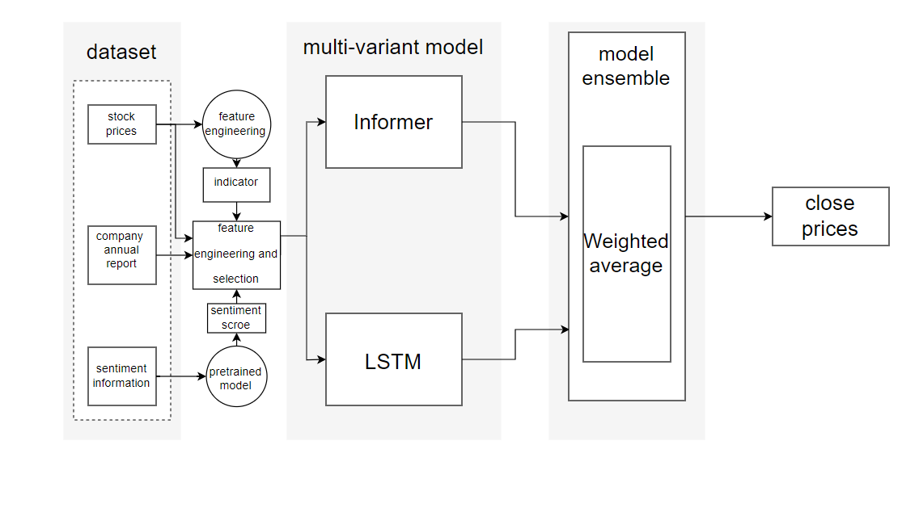

# Data5703



Hi, this is our ensemble model structure. As you can see, it has two sub-models, Informer and LSTM. This repo is about the code of these two models.

In the project experiment, we combine many data sources into many datasets to test not only the robustness of the model but also the effectiveness of the data sources. By using such an experiment method, we can reduce both the bias and the variance of our model.


------

For the **final artifact**, you can find the files and codes:

* dataset: `dataset/bac/8combinations/indi_final_twitter_finbert_avg.csv` , 

* LSTM model:  `lstm/LSTM_indi_final_twitter_finbert_avg_5/LSTM_indi_final_twitter_finbert_avg_5.ipynb`
* Informer model: `Informer/bac_19col_newsent_indi_5@indi_final_twitter_finbert_avg/bac_19col_newsent_indi_5.ipynb`

If you want to repuce the results, be sure the copy the LSTM's predicted results  `indi_final_twitter_finbert_avg.npy` to the Informers folder.


------

For **other relevant datasets and codes**:

* Original dataset link: https://www.kaggle.com/datasets/dgawlik/nyse

* Sentiment score code:  `sentimentScore/mainCode`
* LSTM folder:  `lstm` 
*  Informer and ensemble model folder:  `Informer`


------

As an **instruction** to run the code, it is recommended that you use a machine with a GPU memory greater than 8GB. Although reducing the batch size and other parameters can make the code run normally, the accuracy will be reduced.

In general, it will work fine if you are using up-to-date Python and packages. Our experiment was conducted mainly on Google Colab and a server with the following configuration:

```markdown
| CPU     | Intel Core i3 9100 |
| RAM     | 16G                |
| GPU     | Tesla P40 24G      |
| CUDA    | 11.8               |
| Python  | 3.9.6              |
| Pytorch | 1.12.1+cu102       |
| keras   | 2.10.0             |
```